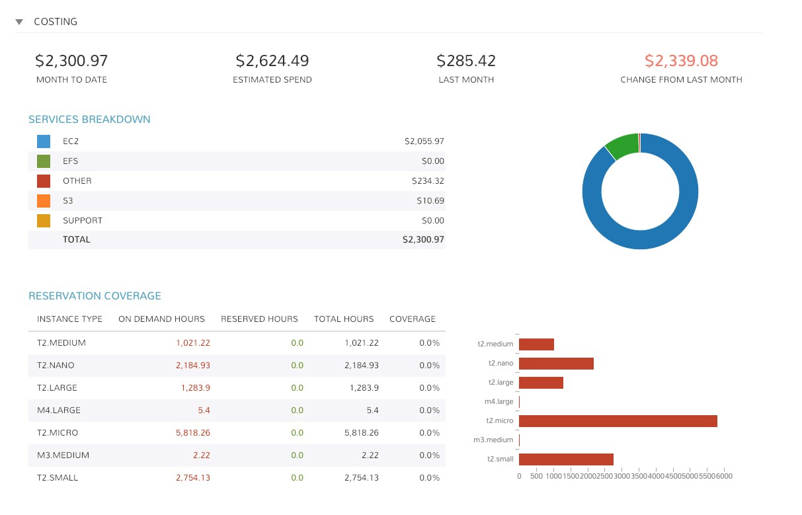
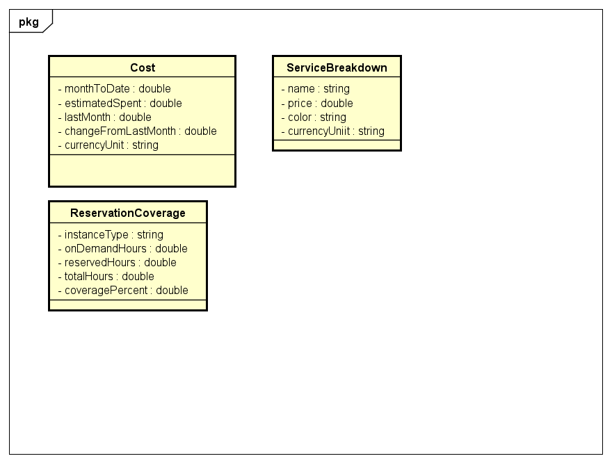
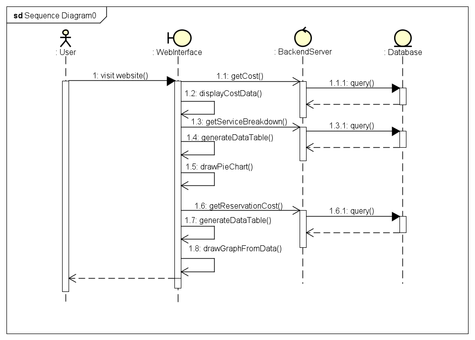

## Estimation
- Day 1 + 2: Design + Tìm hiểu kiến thức + Tạo Mock server + Hoàn thiện Cost component
- Day 3 + 4: Hoàn thiện Services component + chart +  Reservation cost component
- Day 5: Hoàn thiện Reservation cost component + Tối ưu, fix bug(nếu có)

# Angular-practice
- Tạo một application tương tự ảnh dưới sử dụng Angular framework + API server(Mock)

  
## Design
- Design cơ bản cho application

  
