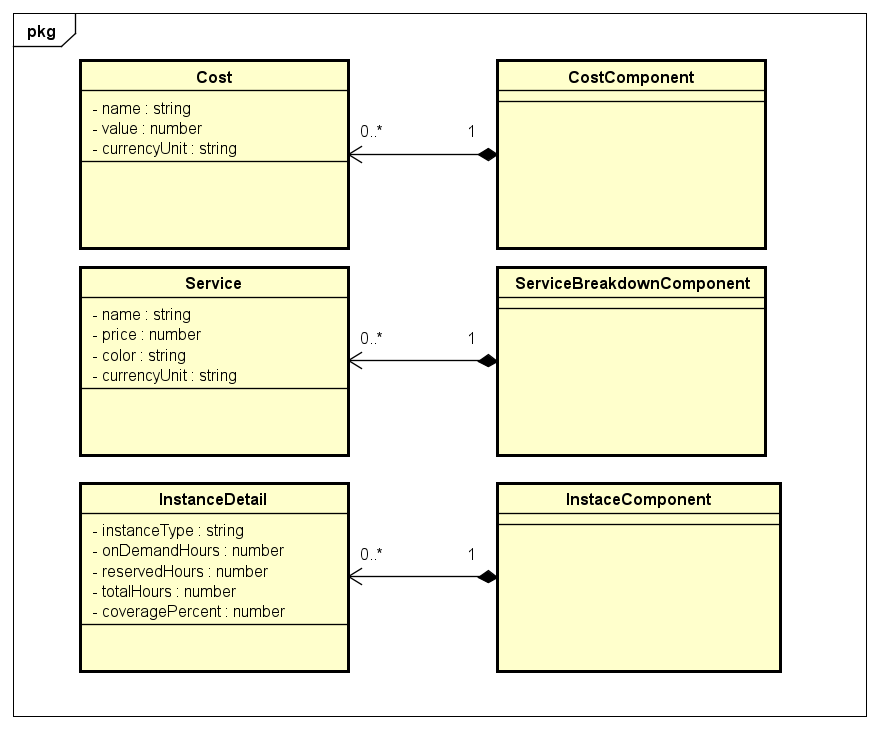

## Estimation
- Day 1 + 2: Design + Tìm hiểu kiến thức + Tạo Mock server + Hoàn thiện Cost component (**Done**)
- Day 3 + 4: Hoàn thiện Services component + chart +  Reservation cost component (**Done**)
- Day 5: Hoàn thiện Reservation cost component (**Done**) + Tối ưu, fix bug(nếu có)

# Angular-practice
- Tạo một application tương tự ảnh dưới sử dụng Angular framework + API server(Mock)

  
## Design
- Design cơ bản cho application

  
## How to run:
- In directory terminal, run the following commands:
- ``npm install``
- ``npm install -g json-server``
- ``json-server --watch db.json``
- ``ng server``
  
